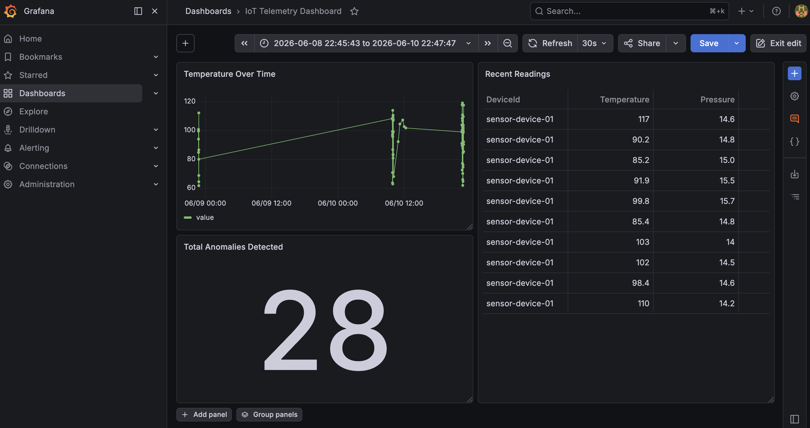
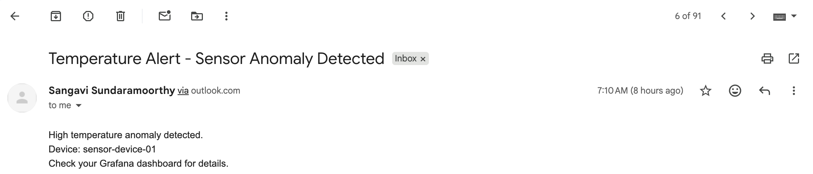
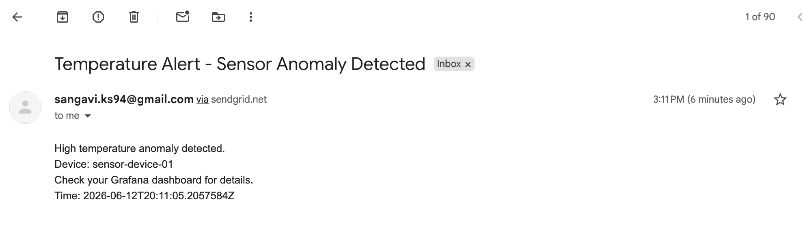
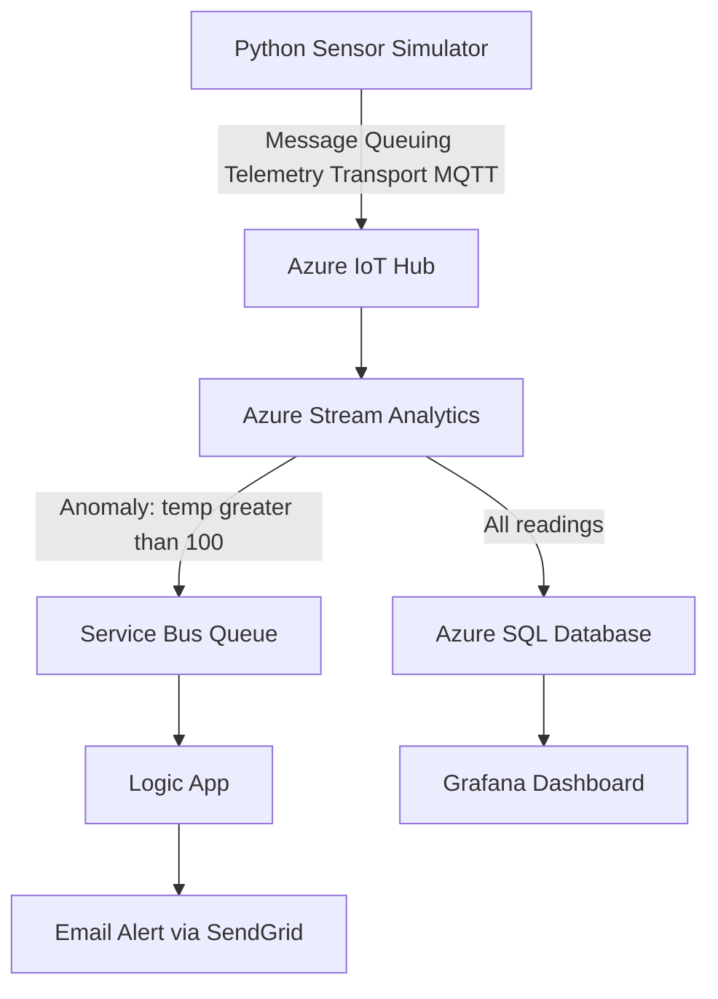

# Azure IoT Telemetry Pipeline

A real-time telemetry pipeline simulating sensor devices streaming data 
to Azure, with anomaly detection, event-driven email alerts, and a live 
Grafana dashboard.







# Architecture



## Features
- Cloud-agnostic Python sensor simulator (`core/` module)
- Real-time ingestion via Azure IoT Hub (F1 free tier)
- Stream processing and anomaly detection with Azure Stream Analytics
- Persistent storage in Azure SQL (free 32GB tier)
- Event-driven email alerts via Service Bus, Logic Apps, and SendGrid
- Live dashboard built with Grafana (auto-refresh every 30s)

## Tech Stack
- **Language:** Python 3.14
- **Cloud:** Azure IoT Hub, Stream Analytics, SQL Database, Service Bus, Logic Apps
- **Email:** SendGrid
- **Visualization:** Grafana
- **Architecture:** Modular design with cloud-agnostic core logic (`core/`), 
  enabling future AWS integration (`aws/`)

## Project Structure
```text
iot-telemetry-project/
├── core/
│   └── sensor.py        # Cloud-agnostic sensor simulation logic
├── azure/
│   └── simulator.py     # Azure IoT Hub integration
├── aws/                 # AWS integration (in progress)
├── screenshots/
│   ├── Grafana-Dashboard.png
│   ├── Outlook-alert-email.png
│   └── SendGrid-alert-email.png
├── requirements.txt
└── README.md
```

## How to Run
1. Clone this repo
2. Create a `.env` file:
AZURE_IOTHUB_CONNECTION_STRING=your-connection-string
3. Create and activate a virtual environment:
```bash
   python3 -m venv venv
   source venv/bin/activate
```
4. Install dependencies:
```bash
   pip3 install -r requirements.txt
```
5. Run the simulator:
```bash
   python3 azure/simulator.py
```

## Setup Notes
- Python 3.14 on macOS requires SSL certificates to be explicitly set. 
  The venv `activate` file sets `SSL_CERT_FILE` and `REQUESTS_CA_BUNDLE` 
  automatically using the certifi bundle.
- Initially used the Outlook connector for email alerts but hit persistent 
  regional throttling (429 errors) on the shared Logic Apps connector 
  infrastructure. Diagnosed via run history and response headers, then 
  migrated to SendGrid for reliable transactional email — a more 
  production-appropriate choice for alerting anyway.

## Cost
This project runs at effectively $0/month using:
- Azure IoT Hub F1 free tier
- Azure SQL free offer (32 GB)
- Service Bus Basic tier (fractions of a cent)
- SendGrid free tier (100 emails/day)
- Grafana (open source, self-hosted)

## What I Learned
- Real-time stream processing and anomaly detection with Azure Stream Analytics
- Event-driven architecture using Service Bus, Logic Apps, and SendGrid
- Debugging connector-level throttling using run history and response headers
- Designing cloud-agnostic Python modules for multi-cloud portability
- Building live operational dashboards with Grafana
- Managing cloud costs using free tiers and budget alerts