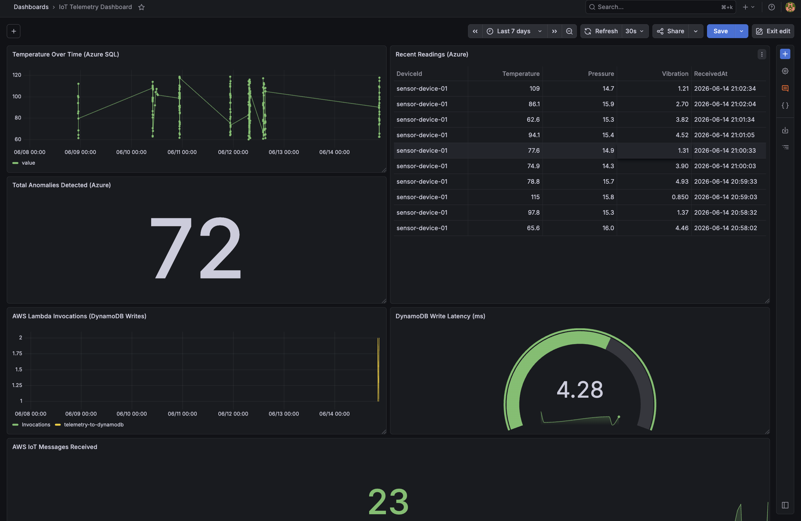
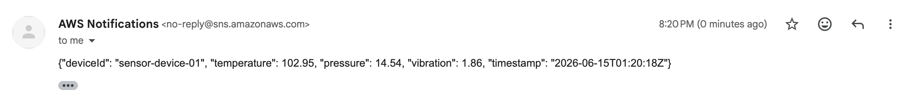
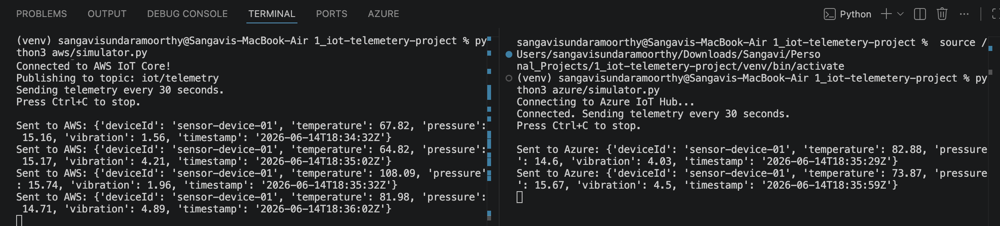
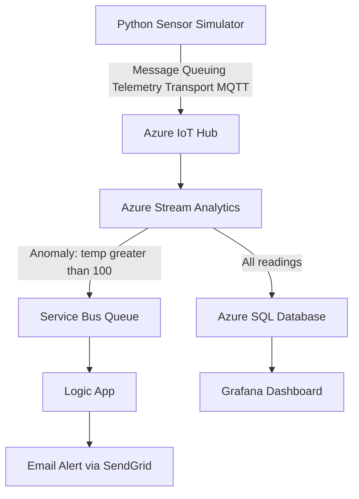
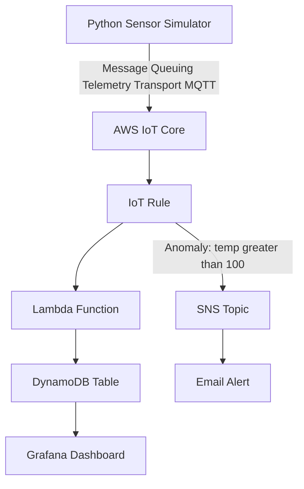

# IoT Telemetry Pipeline

A real-time telemetry pipeline simulating sensor devices streaming data 
to Azure and AWS, with anomaly detection, event-driven email alerts, and a live 
Grafana dashboard.

## Screenshots

### Dual-Cloud Dashboard (Azure + AWS)


### Azure Dashboard


### Azure Email Alert (Outlook)


### Azure Email Alert (SendGrid)


### AWS Email Alert (SNS)


### Both Simulators Running Simultaneously


## Architecture

### Azure Pipeline

### AWS Pipeline



## Features

### Shared
- Cloud-agnostic Python sensor simulator (`core/` module) — same core logic feeds both Azure and AWS
- Live dashboard built with Grafana (auto-refresh every 30s)
- Modular project structure (`core/`, `azure/`, `aws/`) enabling independent cloud deployments

### Azure
- Real-time ingestion via Azure IoT Hub (F1 free tier)
- Stream processing and anomaly detection with Azure Stream Analytics
- Persistent storage in Azure SQL (free 32GB tier)
- Event-driven email alerts via Service Bus, Logic Apps, and SendGrid

### AWS
- Real-time ingestion via AWS IoT Core (MQTT over TLS)
- Serverless processing with AWS Lambda triggered directly by IoT Core rules
- Persistent storage in DynamoDB (25GB free forever, On-demand capacity)
- Event-driven email alerts via AWS SNS (Simple Notification Service)
- Cloud metrics and monitoring via AWS CloudWatch

---

## Tech Stack

  ### Azure
- **Language:** Python 3.14
- **Ingestion:** Azure IoT Hub (F1 free tier)
- **Processing:** Azure Stream Analytics
- **Storage:** Azure SQL Database (free 32GB)
- **Alerting:** Service Bus + Logic Apps + SendGrid
- **Visualization:** Grafana (self-hosted and auto-refresh every 30s)

### AWS
- **Language:** Python 3.14
- **Ingestion:** AWS IoT Core
- **Processing:** AWS Lambda (serverless)
- **Storage:** DynamoDB (25GB free forever)
- **Alerting:** AWS SNS
- **Visualization:** Grafana + CloudWatch

## Project Structure
```text
iot-telemetry-project/
├── core/
│   └── sensor.py          # Cloud-agnostic sensor simulation logic
├── azure/
│   └── simulator.py       # Azure IoT Hub integration
├── aws/                   # AWS integration 
│   ├── lambda_function.py # For reference in this repository hosted in AWS
│   └── simulator.py
├── screenshots/
│   ├── Aws-alert-email.png
│   ├── Dual-cloud-simulators.png
│   ├── Grafana-Dashboard.png
│   ├── Grafana-dual-cloud-dashboard.png
│   ├── Outlook-alert-email.png
│   └── SendGrid-alert-email.png
├── requirements.txt
└── README.md
```

## How to Run

### Prerequisites
1. Clone this repo:
```bash
git clone https://github.com/SangaviKS/azure-aws-iot-telemetry-pipeline.git
cd azure-aws-iot-telemetry-pipeline
```
2. Create and activate a virtual environment:
```bash
python3 -m venv venv
source venv/bin/activate
```
3. Install dependencies:
```bash
pip3 install -r requirements.txt
```

### Run Azure Simulator
1. Add to `.env` file:
```
AZURE_IOTHUB_CONNECTION_STRING=your-azure-connection-string
```
2. Run:
```bash
python3 azure/simulator.py
```

### Run AWS Simulator
1. Add to `.env` file:
```
AWS_IOT_ENDPOINT=xxxxxxxxxxxx-ats.iot.us-east-1.amazonaws.com
AWS_IOT_CERT_PATH=aws/certs/xxx-certificate.pem.crt
AWS_IOT_KEY_PATH=aws/certs/xxx-private.pem.key
AWS_IOT_CA_PATH=aws/certs/AmazonRootCA1.pem
AWS_IOT_CLIENT_ID=sensor-device-01
AWS_ACCESS_KEY_ID=your-access-key-id
AWS_SECRET_ACCESS_KEY=your-secret-access-key
AWS_DEFAULT_REGION=us-east-1
```
2. Place your IoT certificates in `aws/certs/` (excluded from version control)
3. Run:
```bash
python3 aws/simulator.py
```

### Run Both Simultaneously
Open two terminal tabs:
```bash
# Terminal 1 — Azure
python3 azure/simulator.py

# Terminal 2 — AWS
python3 aws/simulator.py
```

---

## Setup Notes

### SSL Certificates (macOS + Python 3.14)
Python 3.14 on macOS does not automatically use system SSL certificates,
causing `SSLCertVerificationError` when connecting to Azure IoT Hub. Fixed
permanently by adding the following to the venv `activate` file:
```bash
export SSL_CERT_FILE=$(python3 -c "import certifi; print(certifi.where())")
export REQUESTS_CA_BUNDLE=$(python3 -c "import certifi; print(certifi.where())")
```
This ensures correct SSL certificates are loaded automatically on every venv
activation — no manual exports needed. Note: AWS IoT SDK uses its own
certificate bundle (`AmazonRootCA1.pem`) and is not affected by this issue.

### Azure Email Alerts
Initially used the Outlook connector for email alerts but hit persistent
regional throttling (429 errors) on the shared Logic Apps connector
infrastructure (`outlook-ncus`). Diagnosed via run history and confirmed
non-cached 429 responses in the raw error headers. Migrated to SendGrid
for reliable transactional email — a more production-appropriate choice
for alerting pipelines.

### AWS Certificates
AWS IoT Core uses mutual TLS authentication via device certificates.
Certificates are stored in `aws/certs/` which is excluded from version
control via `.gitignore`. Never commit certificates or private keys to
GitHub.

### Kinesis Replacement
AWS Kinesis Data Streams is not included in the AWS free tier. Replaced
with a direct IoT Core → Lambda → DynamoDB pipeline which achieves the
same event-driven architecture at $0/month and is simpler to maintain.

## Cost
This project runs at effectively $0/month
### Azure
| Service | Cost |
|---|---|
| Azure IoT Hub F1 free tier | $0 |
| Azure SQL free offer 32GB | $0 |
| Service Bus Basic tier | ~$0.01/month |
| SendGrid free tier 100 emails/day | $0 |
| Grafana open source self-hosted | $0 |
| **Total** | **~$0/month** |

### AWS
| Service | Cost |
|---|---|
| AWS IoT Core 500,000 messages/month | $0 |
| Lambda 1 million invocations/month | $0 |
| DynamoDB 25GB free forever | $0 |
| SNS 1 million notifications/month | $0 |
| Grafana open source self-hosted | $0 |
| **Total** | **$0/month** |

## What I Learned

### Azure
- Real-time stream processing and anomaly detection with Azure Stream Analytics
- Event-driven architecture using Service Bus, Logic Apps, and SendGrid
- Debugging connector-level throttling using run history and response headers
- Designing cloud-agnostic Python modules for multi-cloud portability
- Building live operational dashboards with Grafana
- Managing cloud costs using free tiers and budget alerts

### AWS
- Device-to-cloud messaging using AWS IoT Core and MQTT protocol
- Serverless compute with AWS Lambda triggered by IoT rules
- NoSQL data storage with DynamoDB using partition and sort keys
- Event-driven alerts using SNS topics and email subscriptions
- Cloud monitoring and metrics via CloudWatch and Grafana
- IAM permissions and least-privilege security for cloud services
- Designing cost-free cloud pipelines using AWS free tier services